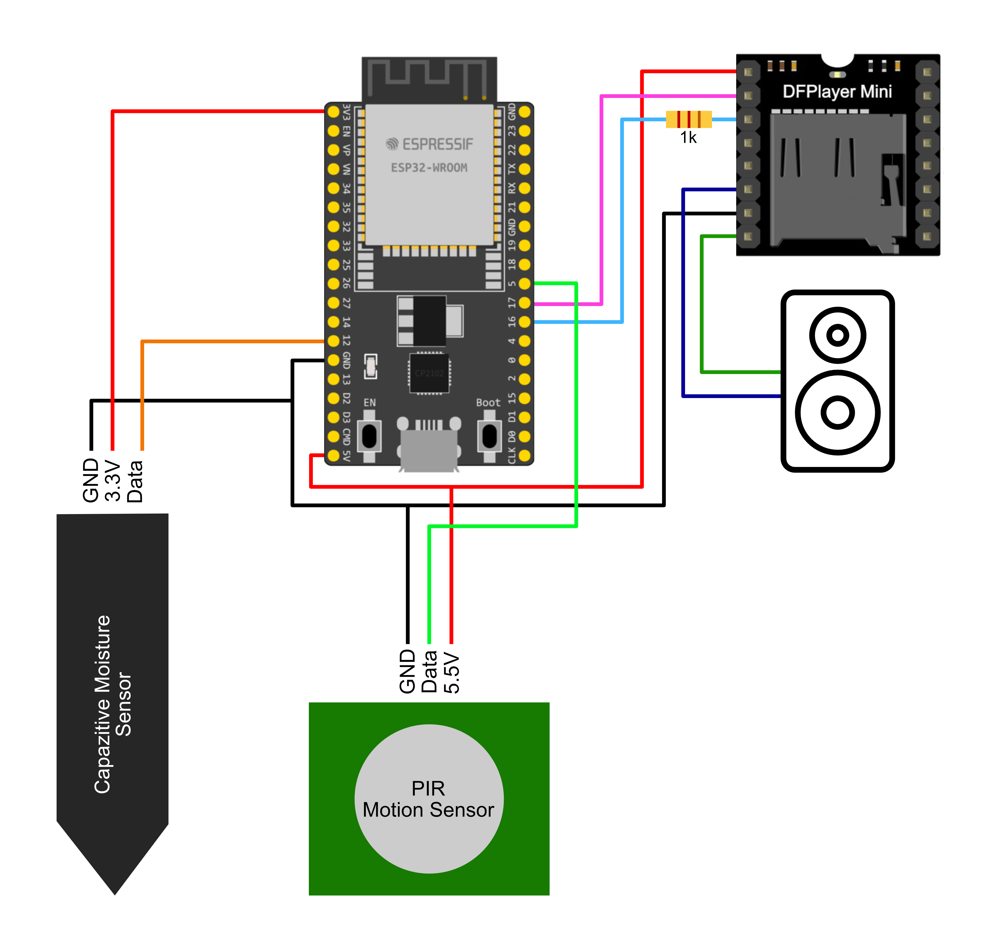

# ThePhlipinator's Smart Planter #
This Planter was designed and programmed by me and is free to use *non-commercially* for everybody who wants to.

Information about Hardware, Wiring and Parameters will be provided in this document.

## Hardware ##
The following components are required to build the Smart Planter:
- 1 x ESP32 Wroom
- 1 x Capacitive Moisture Sensor
- 1 x PIR Motion Sensor (HC-SR501)
- 1 x DFPlayer Mini
- 1 x Laptop Speaker (max 3 Watt)
- 1 x Micro SD Card (16GB or 32GB)
- 1 x 1k Resistor (optional)

## Wiring ##
The _1k resistor_ is optional, but removes noise from the speaker at the cost of some volume.

## Parameters ##
At the beginning of the *main.py* file 3 parameters can be adjusted:
### Files ##
The number of audio files you have on your microSD card in folder 01
### Timer ###
The amount of seconds you want to wait between checks
### Threshold ###
The moisture threshold (0-2500). You may want to play around with this for a bit. 2500 is very dry and 0 would be very wet.

## SD Card ##
The used micro SD card needs to be either 16 or 32 GB and formatted in *FAT32*.
The audio files can be either *mp3* or *WAV* and need to be stored using this file structure:
- 01
	- 001.mp3
	- …
	- 999.mp3
- 02
	- 001.mp3

In Folder 01 you can put all your audio files with corresponding numbers.
Folder 02 contains a startup sound that is played once when the planter is connected to power.
I will provide sample audio files in the sd_card folder.

Load the contents of the *src* folder onto your ESP32 and the contents of the sd_card folder onto your micro SD card.

## Acknowledgements ##
Special thanks go to **@Muhlex** for providing the library to use the DFPlayer Mini together with Micropython and helping me setting it up.
Check out his work at https://github.com/Muhlex/dfplayer-mp.